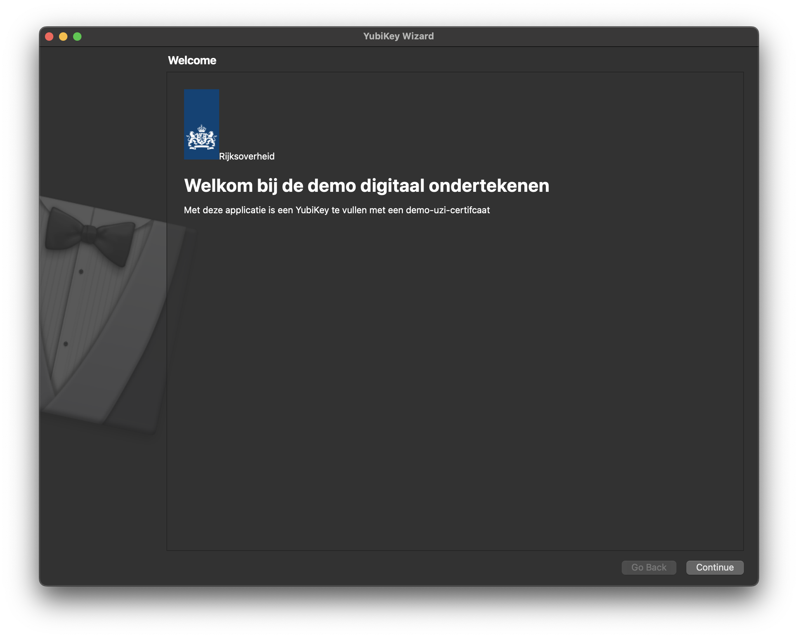
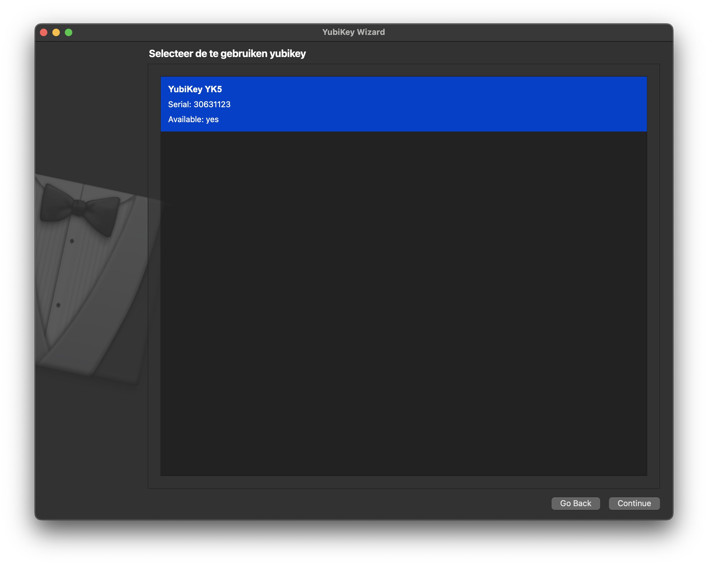
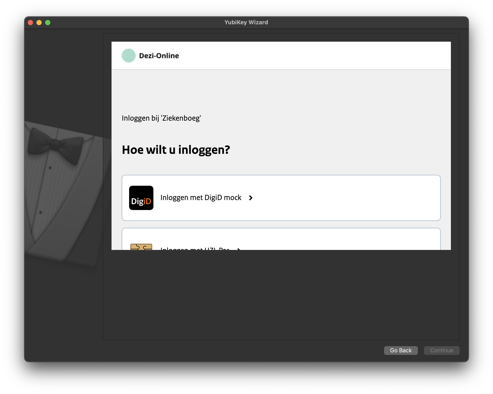
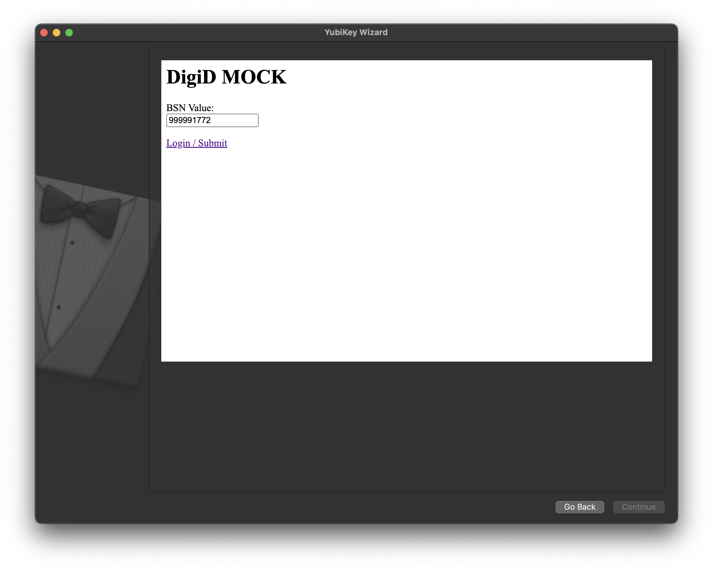
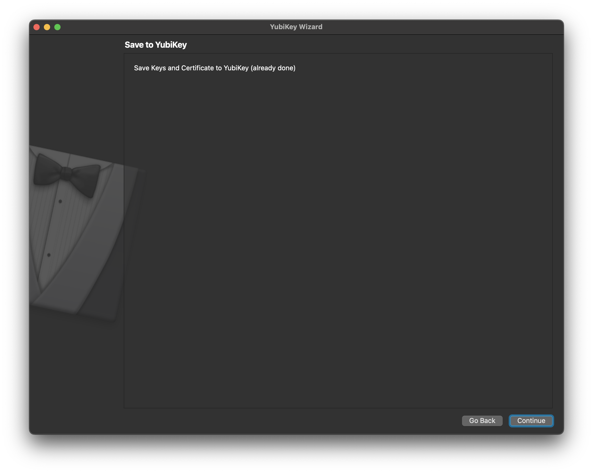

# Local setup

## Requirements
- `python3.13`
- `docker`
- `git`

## Installation
### 1.1 Creating a virtual environment
To create an isolated environment where we can install the Python requirements in, use the below command to use the `venv` package:

```bash
python -m venv .venv
source .venv/bin/activate
```

This will create the environment and activate it.

### 1.2 Installing the requirements
In the root of the project, open up a terminal and run the command underneath.

```bash
pip install -r requirements.txt
```


## Starting up the application
In the root of the project and the virtual environment activated, run the command below. Make sure you also have a Yubikey inserted in your computer.

```bash
python -m app.wizard
```

This will start up the application. Then, walk through the following steps:
   
1. This will open up the initial screen, press continue.


2. This screen allows you to select a YubiKey, select yours and click continue.
3. The next step is to login. In here, select the "Inloggen met DigiD mock" method.  You will then be presented with a mock BSN number. In here, click the "Login / Submit" button. Under the hood, a JWT is now fetched.



4. The certificate is now created and saved on the Yubikey.

Now, press continue again. The application can now be exited.