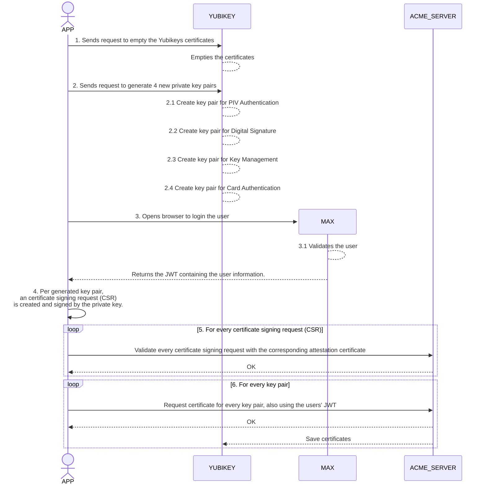

# PoC with Yubikey

In order to automate certificate issuance for UZI, a PoC was done with a YubiKey and an ACME server. The keypairs are generated on the YubiKey and the certificate is issued by the ACME server. This document will give you an high overview.

### Steps

- The YubiKey is reset: all the certificates on the device will be removed.
- We will generate 4 public and private key pairs on the YubiKey. These are for PIV Authentication, Digital Signature, Key Management and Card Authentication. Next to that, the YubiKey will generate additional attestation certificates, to prove that the private key is generated on the YubiKey itself. The private keys will always remain in the YubiKey.
- The user logs in via the chosen [authentication flow](./AUTH_FLOW.md). This returns an JWT, containing the user information.
- Per generated key pair, an certificate signing request (CSR) is created and signed by the private key.
- Finally, each certificate signing request with the corresponding attestation certificate is validated at the ACME server. When this is done, the server will issue an certificate for every key pair. Here, the JWT of the user is also used. This is done with the ACME server of iRealisatie. These are then saved back into the YubiKey into the corresponding slot.

Now it is possible to use the certificate on the YubiKey to sign data.

#### Diagram flow

This diagram expects that the Yubikey is already plugged in the user's computer. Next to that, it's expected that the user should use the **DigiD mock** login method.

### Disclaimer

This Repository is created as a PoC (Proof of Concept) as part of the project _Toekomstbestendig maken UZI_, and **should not be used as is in any production environment**.

### Licentie

This project is licensed under the [EUPL-1.2 license](./LICENSE.txt).
