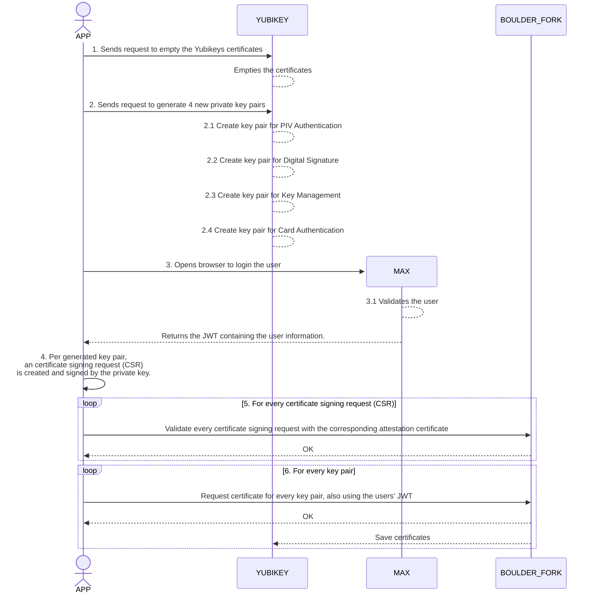

# nl uzipoc-yubisign
In order to automate certificate issuance for UZI, this PoC was done with a YubiKey (an hardware token) and an ACME server. The keypairs are generated on the YubiKey and the certificate is issued by the ACME server. This document will give you an high overview.

## Disclaimer
This Repository is created as a PoC (Proof of Concept) as part of the project _Toekomstbestendig maken UZI_, and
**should not be used as is in any production environment**.

## Wat doet dit?

Dit neemt een yubikey (doe maar versie 5) en maakt daarin de PIV module _leeg_

Nadat deze leeg is worden er 4 keys aangemaakt in de yubikey

Er wordt contact gelegd met de rdo-acme service. En er worden 4 orders aangemaakt

Van deze 4 orders wordt de unique-anti-replay-token meegestuurd met een uzi-labs digid login verzoek

Er wordt een browser geopend in de applicatie zelf, daarmee log je in als zorg identiteit bij de ziekenboeg-uzi-labs

De app haalt hierna de JWT-token op bij ziekenboeg-uzi-labs waarin de 4 acmetokens zitten.

Er wordt van de yubikey zelf opgehaald:

- Het intermediate certificaat behorende bij de yubikey zoals geleverd door yubico op de yubikey zelf

Per sleutel op de yubikey:

- Een door de yubikey ondertekend certificaat per sleutel waarin de garantie (attestation) staat dat de sleutel echt op een yubikey is gemaakt
- een CSR verzoek ondertekend door de aangemaakte sleutel

Per order wordt dan verstuurd:

- De JWT
- Het yubikey intermediate certificaat
- Het attestation certificaat

De acme server controleert dan per order:

- of het attestation certificaat van de sleutel klopt
- het token voor order in de JWT zit
- De JWT goed is en van een geldige uzi-cibg-labs-uitgever komt

Als dat klopt dan geeft de acme server terug dat het klopt en dan vraagt deze app in de laatste stap een certificaat aan met de eerder genoemde CSR.

Als de CSR dezelfde public key heeft als in de vorige stap gecontroleerde gegevens wordt er een Labs-UZI certifcaat uitgegeven op basis van de gegevens in de JWT.
Dit certificaat bevat de huidige UZI-Certificaten structuur.

Als er een certificaat is opgehaald wordt dit opgeslagen op de juiste plek in de yubikey.

Door het laden van de yubikey pkcs11 library in de browser, office, mac os, windows of linux plekken (zoals beschreven door yubico) kan de yubikey daarna
worden gebruikt zoals een UZIpas ook gebruikt kan worden. Voor digitaal ondertekenen van documenten, verzoeken en om in te loggen in de browser bij
partijen die UZI certificaten login mogelijk maken.

#### Diagram flow
This diagram expecst that the key is already plugged in the user's computer.

## Configureren omgevingsvariabelen

Er zijn een aantal variabelen te configureren via een `.env` bestand. Kopieer en hernoem hiervoor het `.env.example` bestand en vul de desbetreffende waardes in. Zie de tabel hieronder voor de desbetreffende waarden.

|         Variabel         |                  Standaard waarde                   | Type  |
| :----------------------: | :-------------------------------------------------: | :---: |
|     `ACME_CA_SERVER`     | `"https://acme.proeftuin.uzi-online.rdobeheer.nl/"` | `str` |
|      `YUBIKEY_PIN`       |                     `"123456"`                      | `str` |
| `OIDC_PROVIDER_BASE_URL` |    `"https://proeftuin.uzi-online.rdobeheer.nl"`    | `str` |

Standaard word gebruikt gemaakt de volgende waarden: `"https://acme.proeftuin.uzi-online.rdobeheer.nl/"` voor de CA server en `123456` voor de YubiKey PIN. Dit is te configureren in een `.env` bestand. Kopieer en hernoem hiervoor het `.env.example` bestand en vul de desbetreffende waardes in.
# Licentie
Dit project valt onder de [EUPL-1.2 license](./LICENSE.txt).
