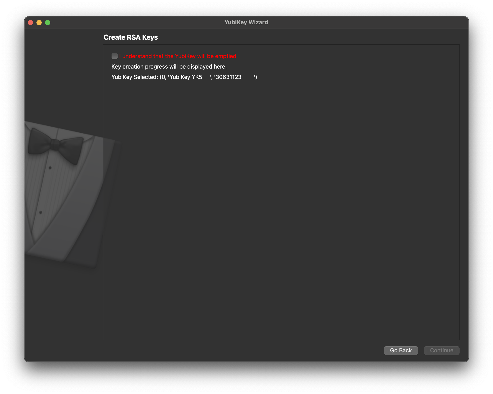

# Local setup
First clone this repository and checkout the `uzipoc_q4_2024` branch. You can then follow this document to set up and run the application.

```bash
git clone --single-branch --branch uzipoc_q4_2024 git@github.com:minvws/nl-uzipoc-yubisign.git
```


## Requirements
This application requires the [`yubico-piv-tool`](https://developers.yubico.com/yubico-piv-tool/) installed on your computer and therefor the `libykcs11` library. The `yubico-piv-tool` needs to be available in your system path. Next to that, the [`ykman`](https://developers.yubico.com/yubikey-manager/Releases/) CLI is also required in your path. make sure you have the following tools:

- **`python3.13`**: Make sure the executable is also accessible from your local terminal.
- **`git`**: To update the application when needed.

This application should be used with the [Yubikey 5C NFC]( https://www.yubico.com/nl/product/yubikey-5-series/yubikey-5c-nfc/).

#### Windows specific
> When installing Python on Windows, make sure to add `python.exe` to your PATH and disable path length limit during the installation.

> The PIV tool can be installed via [this link](https://developers.yubico.com/yubico-piv-tool/Releases/).

- Make sure you install Microsoft Visual C++ 14.0 or greater, installable via the [Microsoft C++ Build Tools](https://visualstudio.microsoft.com/visual-cpp-build-tools/). Make sure these components are installed:
  - Visual C++ Build tools core features.
  - MSVC toolset C++ 2019 v142 (x86,x64)
  - Visual C++ 2019 Redistributable Update
  - Windows 10 SDK (10.0.17763.0) for Desktop C++
- Make sure you have added the directory where the `libykcs11.dll` library is located to the system PATH. See [the documentation](https://developers.yubico.com/yubico-piv-tool/YKCS11/) for more information.


## Installation

### 1.1 Creating and activating a virtual environment

First, verify if the Python version was set to `3.13`

```bash
python --version
```
Then to create an isolated environment where we can install the Python requirements in, use the below command to use the `venv` package.

```bash
python -m venv .venv
```

For UNIX-based systems, the environment can be activated with the following command.

```bash
source .venv/bin/activate
```

For Windows systems, this is `.\.venv\Scripts\activate`.

### 1.2 Installing the requirements

In the root of the project, open up a terminal and run the command underneath.

```bash
pip install -r requirements.in
```

### 1.3 Configuring environment variables

There are a few environmnent variables which need to be configured via the `.env` file. For this, copy and rename the `.env.example` file and fill in the corresponding values. See the table underneath for the examples.

|          Variable           |                         Default value                          | Type  |
| :-------------------------: | :------------------------------------------------------------: | :---: |
| `ACME_SERVER_DIRECTORY_URL` | `"https://acme.proeftuin.uzi-online.rdobeheer.nl/directory"` | `str` |
|        `YUBIKEY_PIN`        |                           `"123456"`                           | `str` |
|  `OIDC_PROVIDER_BASE_URL`   |        `"https://proeftuin.uzi-online.irealisatie.nl"`         | `str` |

The `ACME_SERVER_DIRECTORY_URL` should be set to the the directory URL of the ACME server. For example, this can be `http://localhost:8080/acme/directory` when working with the local ACME server developed by iRealisatie.

## 2. Starting up the application

In the root of the project and the virtual environment activated, run the command below. Make sure you also have a Yubikey inserted in your computer.

```bash
python -m app.wizard
```

This will start up the application. Then, walk through the following steps:

#### 2.1 Open up the application


This will open up the initial screen, press continue.

#### 2.2 Selecting the Yubikey

This screen allows you to select a YubiKey. Select yours and click continue.


#### 2.3 Creating the RSA keys
This step creates the RSA keys on the selected Yubikey. In here, tick the checkbox and click continue.


#### 2.4 Logging in

The next step is to login. In here, select the "Inloggen met DigiD mock" method.


You will then be presented with a mock BSN number. In here, click the "Login / Submit" button. Under the hood, a JWT is now fetched.


#### 2.5 Finalizing

The certificate is now created and saved on the Yubikey. Now, press continue again. The application can now be exited.

