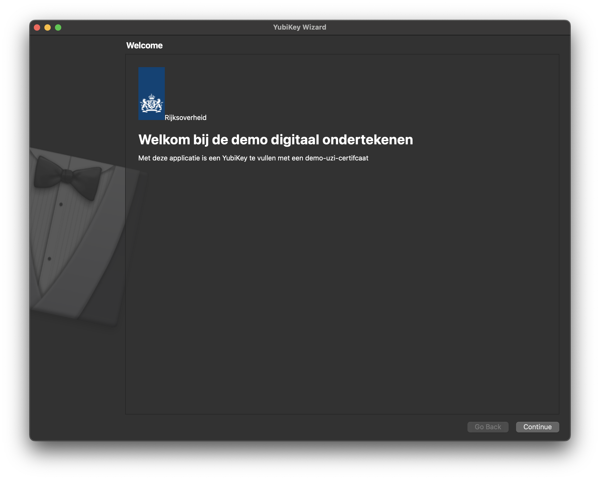
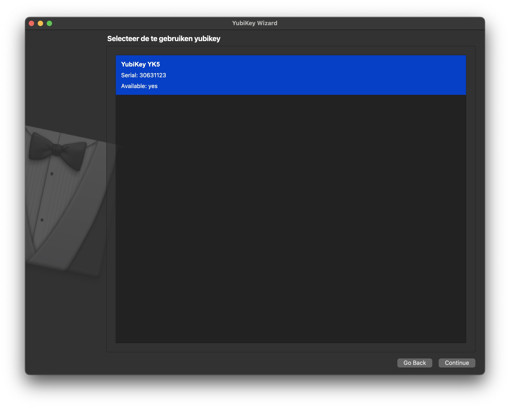
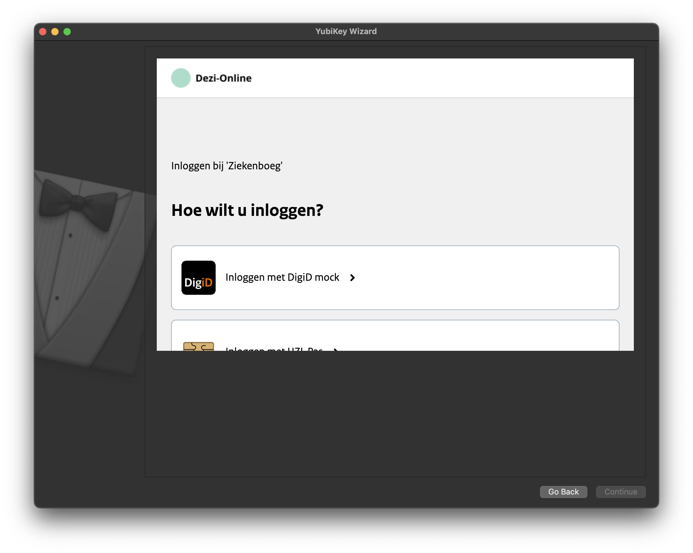
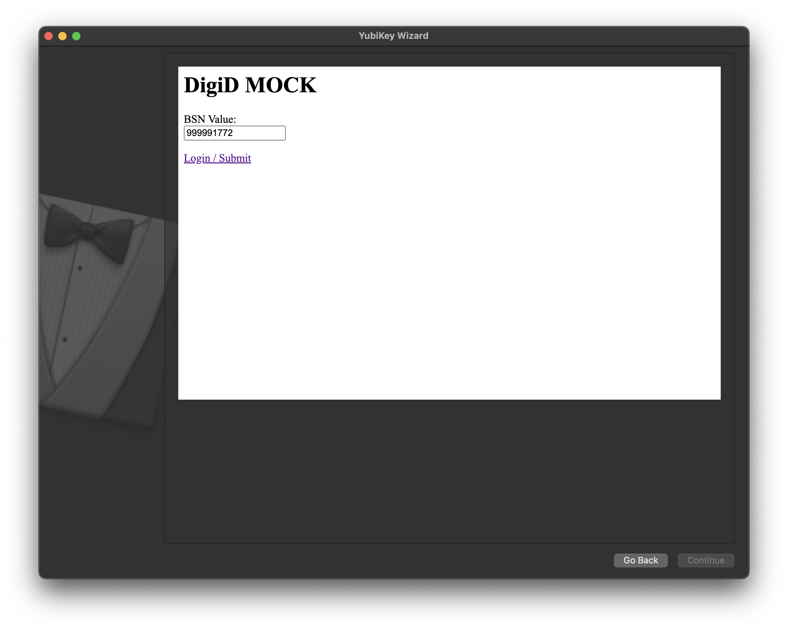
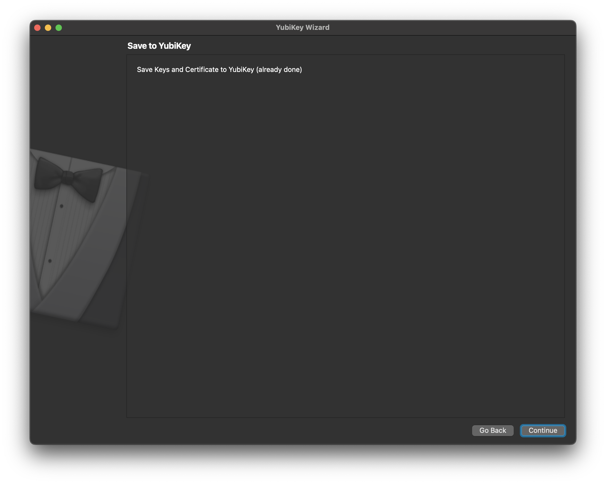

# Local setup

After cloning this repository, you can follow this document to set up and run the application.

## Requirements

This application requires the [`yubico-piv-tool`](https://developers.yubico.com/yubico-piv-tool/) installed on your computer and therefor the `libykcs11` library. Next to that, make sure you have the following tools:

- **`python3.13`**: Make sure the executable is also accessible from your local terminal.
- **`git`**: To update the application when needed.

## Installation

### 1.1 Creating and activating a virtual environment

To create an isolated environment where we can install the Python requirements in, use the below command to use the `venv` package.

```bash
python3.13 -m venv .venv
```

For UNIX-based systems, the environment can be activated with the following command.

```bash
source .venv/bin/activate
```

For Windows systems, this is `.\venv\Scripts\activate`.

### 1.2 Installing the requirements

In the root of the project, open up a terminal and run the command underneath.

```bash
pip install -r requirements.in
```

### 1.3 Configuring environment variables

There are a few environmnent variables which need to be configured via the `.env` file. For this, copy and rename the `.env.example` file and fill in the corresponding values. See the table underneath for the examples.

|          Variable           |                         Default value                          | Type  |
| :-------------------------: | :------------------------------------------------------------: | :---: |
| `ACME_SERVER_DIRECTORY_URL` | `"https://acme.proeftuin.uzi-online.irealisatie.nl/directory"` | `str` |
|        `YUBIKEY_PIN`        |                           `"123456"`                           | `str` |
|  `OIDC_PROVIDER_BASE_URL`   |        `"https://proeftuin.uzi-online.irealisatie.nl"`         | `str` |

The `ACME_SERVER_DIRECTORY_URL` should be set to the the directory URL of the ACME server. For example, this can be `http://localhost:8080/acme/directory` when working with the local ACME server developed by iRealisatie.

## 2. Starting up the application

In the root of the project and the virtual environment activated, run the command below. Make sure you also have a Yubikey inserted in your computer.

```bash
python3.13 -m app.wizard
```

This will start up the application. Then, walk through the following steps:

#### 2.1 Open up the application


This will open up the initial screen, press continue.

#### 2.2 Selecting the Yubikey

This screen allows you to select a YubiKey. Select yours and click continue.


#### 2.3 Logging in

The next step is to login. In here, select the "Inloggen met DigiD mock" method.


You will then be presented with a mock BSN number. In here, click the "Login / Submit" button. Under the hood, a JWT is now fetched.


#### 2.4 Finalizing

The certificate is now created and saved on the Yubikey. Now, press continue again. The application can now be exited.

