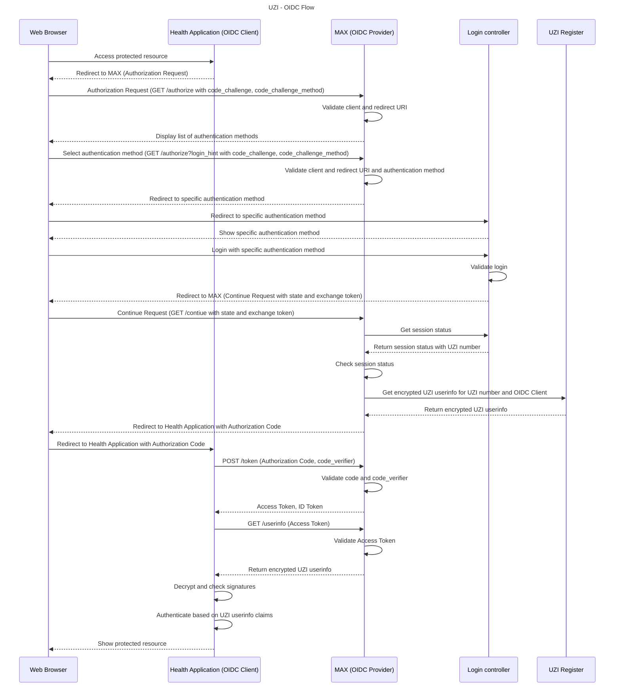

# Authentication flow
The flow is visualized in the [README file under the "Flow overview" header](../README.md#flow-overview), however, we also decided to make a variant going through the individual steps. 

Every authentication request from a webapplication starts with a redirect to MAX (Multiple Authentication eXchange), which is a seperate application. Here the user is presented with the various login options, where they select one.

The authentication flow uses the Authorization Code Flow with [PKCE](https://www.rfc-editor.org/rfc/rfc7636) of [OpenID Connect](https://openid.net/specs/openid-connect-core-1_0.html).

### Definitions
- **MAX (Multiple Authentication eXchange):** [MAX](https://github.com/minvws/nl-rdo-max) is build as an OIDC Identity Provider. The main purpose is a SAML to OIDC bridge for TVS (ToegangVerleningService). The functionality of MAX is extended for the UZI project by using the Login Controller. After signin with a specific login method, MAX will request the UZI information from CIBG and return this information in the userinfo.
- **TVS (ToegangVerleningService):** An SAML Identity Provider for eHerkenning and DigiD. See the [TVS Website](https://www.dictu.nl/toegangverleningservice) for more information.
- **Login Controller:** The [Login Controller](https://github.com/minvws/nl-uzi-login-controller) is an application that manages the sessions for login methods exchanged through MAX for UZI. The login methods that are managed are Yivi, UZI-pas and Middelenleverancier (resource provider) through OpenID Connect. 
- **Platformleverancier (platform supplier):** The supplier for building and providing the healthcare application.
- **Middelenleverancier (resource provider):** The supplier for building and providing the concrete authentication resource. For example, an employee card of a hospital.
  
## DigiD flow
1. The `GET /authorize` is called on the MAX application. The user then is redirected to the TVS front-end where a login request is made.
2. On success, an `/acs` redirect is done to MAX (SAMLArt, RelayState).
3. From the MAX application, an AuthN request is made to the TVS back-end and CIBG is queried from the encrypted BSN number. From here, an identity is fetched from the UZI register and returned to MAX. This information is specifically encrypted for the healthcare application.

## Exchange token based flow (Yivi, UZI-pas, ...)
This flow starts by the user trying to reach an endpoint that is protected. Then:
1. The `GET /authorize` is called on the MAX application with the required parameters. 
2. The MAX application then validates the client and the redirect URI. The application then shows a list of authentication methods.
3. The user selects an authentication method (`GET /authorize?login_hint` with the required parameters)
4. The MAX application validates the client and the authentication method.
5. The user is re-directed to the selected authentication method on the login controller. Per authentication method, different logic is used in the login controller. For concrete examples, please refer to the [source code of the login controller](https://github.com/minvws/nl-uzi-login-controller).
6. The user logs in with the selected authentication method. The login controller validates that. The user is then redirected (`GET /continue`) to the MAX application with state and the exchange token.
   
Then, when this is done, the following steps are made.
1. The session status is retrieved from the login controller with the exchange token. Together with the session status, this also returns an UZI number. The MAX application then verifies the session status. 
2. The UZI register is now queried to retrieve the encrypted UZI user info.
3. A redirect is now made to the healthcare application with an authorization code. 
4. With the authorization code and required parameters, the `POST /token` endpoint can now be called on the MAX application from the healthcare application. This will return an access and ID token. After that, the healthcare application can now fetch the `GET /userinfo` endpoint on the MAX application and is able to retrieve encrypted UZI user info.

